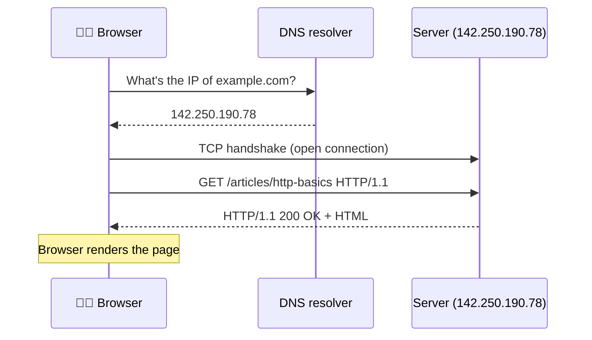

## 1. How does the internet actually work?

Before HTTP, there's the internet underneath it. The internet is a giant network of computers that have agreed on **how to find each other** and **how to pass messages**.

Two ideas do almost all the heavy lifting:

- **IP addresses** — every machine on the network has a number, like `142.250.190.78`. It's the postal address of a computer.
- **DNS (Domain Name System)** — humans can't remember numbers, so DNS is the phone book that turns `google.com` into that IP address.

When you type a web address, your computer first asks DNS "what's the IP for this name?", then opens a connection to that IP, then speaks **HTTP** over that connection. The whole journey looks like this:

Steps 1–2 happen once and get cached; steps 3–5 repeat for every resource the page needs.

Think of sending a letter. <b>DNS</b> is looking up your friend's street address in a contact list. <b>IP</b> is that street address. <b>TCP/IP</b> (the transport layer) is the postal service that guarantees your envelope arrives, in order, even if it has to be split across several trucks. <b>HTTP</b> is the <i>language written inside the letter</i> — the agreed format so the recipient understands what you're asking for.

The key mental shift: **the network just moves bytes**. HTTP is a *convention* layered on top so both sides agree what those bytes mean.

The first web server in history was Tim Berners-Lee's NeXT computer at CERN. It carried a handwritten note on the case: <i>"This machine is a server. DO NOT POWER IT DOWN!!"</i> — because switching off that one box would have switched off the entire World Wide Web.

