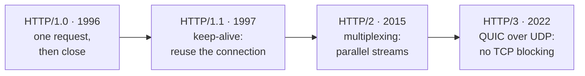

## 6. Evolution of HTTP

HTTP got faster by fixing how it uses the underlying connection:

- **HTTP/1.0** — one request, one connection, then close. Slow: every request paid the cost of a new connection.
- **HTTP/1.1** — *keep-alive* connections (reuse one connection for many requests) and pipelining. Still suffered **head-of-line blocking**: requests on a connection wait in line.
- **HTTP/2** — **multiplexing**: many requests share one connection *in parallel*, plus header compression. Big speed win.
- **HTTP/3** — drops TCP for **QUIC** (built on UDP). Removes TCP-level head-of-line blocking and connects faster, especially on flaky mobile networks.

HTTP/1.0 = a single-lane drive-through where each car must leave before the next pulls in. HTTP/1.1 = the car stays and orders several times (keep-alive), but still one car at a time. HTTP/2 = a multi-lane drive-through on one road (multiplexing). HTTP/3 = they rebuilt the road itself (QUIC over UDP) so one stalled lane no longer freezes the others.

The timeline actually starts before 1.0: the original 1991 protocol, retroactively named <b>HTTP/0.9</b>, was a single line of text — <code>GET /page</code>. No headers, no status codes, no POST, no version number. The server sent back raw HTML and closed the connection. Everything in this chapter was bolted on later.

