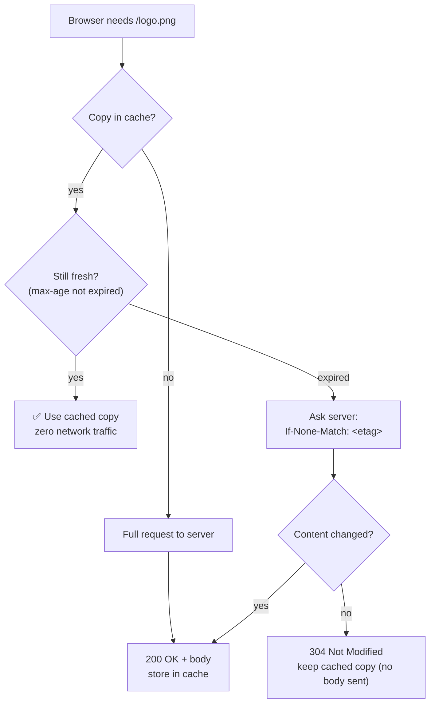

## 8. HTTP caching

Fetching the same logo image on every page load is wasteful. **Caching** stores a copy closer to the user so the next request is instant and the server is spared.

Two flavors:

- **Client-side cache** — the browser keeps a local copy.
- **Server-side / intermediary cache** — a CDN or proxy (like Varnish, Cloudflare, Fastly) sits between client and server and serves copies to *everyone*.

Control headers:

- `Cache-Control: max-age=3600` — "fresh for 1 hour, don't even ask."
- `ETag` — a fingerprint of the content. The client later sends `If-None-Match: <etag>`; if unchanged the server replies `304 Not Modified` with **no body** — saving bandwidth.

Here is the decision the browser makes on every request:

A cache is your fridge. Instead of going to the supermarket (origin server) every time you want milk, you keep some at home (browser cache) or share a communal fridge on your floor (CDN). <code>max-age</code> is the "best before" date. An <code>ETag</code> check is calling the shop to ask "is there a newer carton than mine?" — if not, you save the whole trip (<code>304</code>).

The logo in your browser cache has passed its <code>max-age</code>. What does the browser do next time the page needs it?

<button class="quiz-opt">Throws the stale copy away and downloads the full image again</button>
<button class="quiz-opt" data-correct>Asks the server with <code>If-None-Match: &lt;etag&gt;</code> — and keeps its copy if the answer is <code>304</code></button>
<button class="quiz-opt">Keeps using the cached copy without contacting the server</button>

Expired doesn't mean useless — it means "check before using." The conditional request lets the server answer <code>304 Not Modified</code> with <b>no body</b>, so the full download only happens when the content actually changed. Using the copy without asking is only allowed while <code>max-age</code> says it's still fresh.

