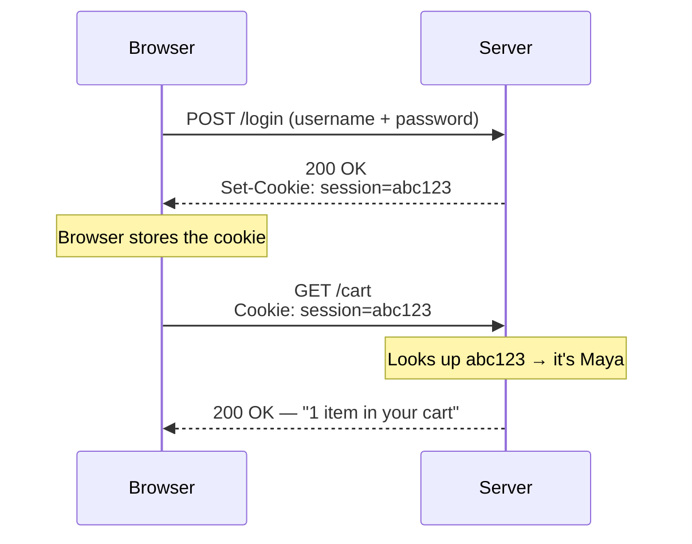

## 9. Cookies

HTTP is **stateless** — the server forgets you the instant the response is sent. Cookies are the workaround for "remember me between requests."

Flow:

1. Server sends `Set-Cookie: session=abc123` in a response.
2. Browser stores it.
3. Browser automatically sends `Cookie: session=abc123` on every future request to that site.
4. Server looks up `abc123` and knows who you are.

Important attributes: `HttpOnly` (JS can't read it — blocks theft via XSS), `Secure` (HTTPS only), `SameSite` (limits cross-site sending — blocks CSRF).

A cookie is the coat-check ticket. The cloakroom (server) doesn't remember your face — it would forget you instantly. Instead it hands you a numbered ticket (<code>Set-Cookie</code>). You show that ticket every time (<code>Cookie</code> header), and they fetch your coat. The ticket is meaningless to anyone but that cloakroom, and a good ticket is hard to forge (<code>HttpOnly</code>, <code>Secure</code>).

After login set <code>session=abc123</code>, your frontend calls <code>GET /cart</code> — and the code never touches cookies at all. Does the server still know it's Maya?

<button class="quiz-opt">No — the code must read the cookie and attach a <code>Cookie</code> header itself</button>
<button class="quiz-opt" data-correct>Yes — the browser attaches matching cookies to every request to that site automatically</button>
<button class="quiz-opt">Only if the request is a POST, like the login was</button>

Step 3 of the flow is the whole trick: the <b>browser</b> sends <code>Cookie: session=abc123</code> on every future request to that site — your code never handles it. That's also why <code>HttpOnly</code> session cookies work at all (JS can't read them and doesn't need to), and why <code>SameSite</code> exists: cookies tag along even on requests you didn't intend.

Cookies were invented in 1994 by Lou Montulli, a Netscape engineer who needed a way to build a shopping cart that survived between page loads. The name isn't about baking — it comes from <i>"magic cookie"</i>, a much older programmers' term for a small opaque token passed between programs.

