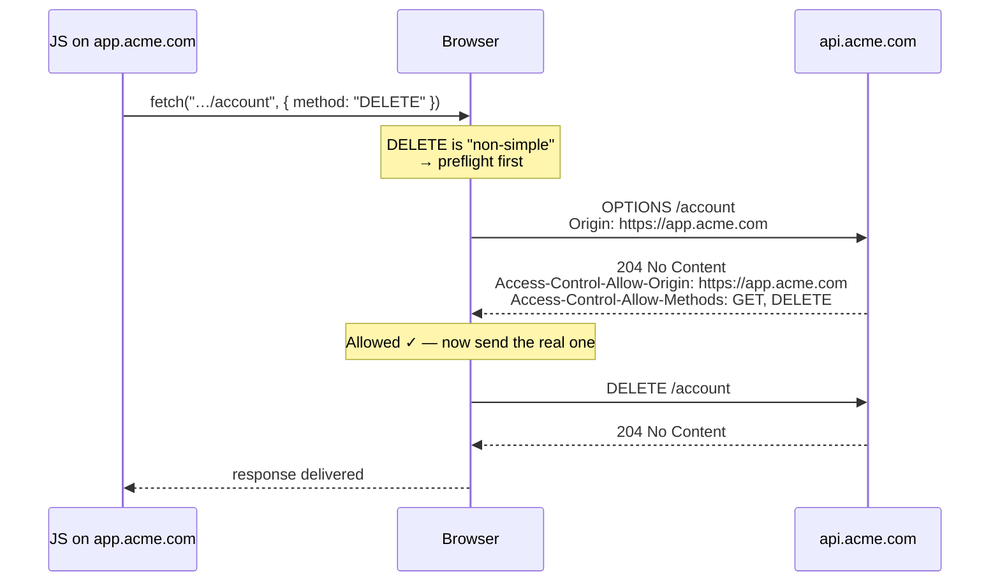

## 10. CORS (Cross-Origin Resource Sharing)

By default, browsers enforce the **same-origin policy**: JavaScript running on `https://myapp.com` cannot read responses from `https://api.other.com`. This stops a malicious site from quietly reading your bank's data using *your* logged-in session.

**CORS** is how a server *opts in* to allowing specific other origins. The server sends headers like:

```http
Access-Control-Allow-Origin: https://myapp.com
Access-Control-Allow-Methods: GET, POST
```

For "non-simple" requests the browser first sends a **preflight** `OPTIONS` request asking "am I allowed?" before sending the real one:



<p class="diagram-caption">If the preflight fails, the real request is never sent — the server's DELETE handler never even runs.</p>

<div class="analogy">
Same-origin policy is a building where your office keycard only opens your own floor. CORS is the building manager (the API server) explicitly adding your card to the access list for <i>another</i> floor. The preflight <code>OPTIONS</code> request is the security guard phoning ahead — "someone from floor 3 wants in, are they cleared?" — before letting you through.
</div>

> **CORS is enforced by the browser, not the server.** `curl` and your backend ignore it entirely. That's why an API call works in Postman but fails in the browser — a constant source of fresher confusion.

<div class="quiz">
<div class="quiz-q">JS on <code>app.acme.com</code> calls <code>fetch("https://api.acme.com/account", { method: "DELETE" })</code>, but the API sends no CORS headers. Does the server's DELETE handler run?</div>
<button class="quiz-opt">Yes — the request is sent, but the browser hides the response from the JS</button>
<button class="quiz-opt" data-correct>No — the preflight <code>OPTIONS</code> fails, so the DELETE is never sent at all</button>
<button class="quiz-opt">Yes — CORS only restricts GET requests that read data</button>
<div class="quiz-why">DELETE is "non-simple", so the browser asks permission first with a preflight <code>OPTIONS</code> — and without the right <code>Access-Control-Allow-*</code> answer, the real request never leaves the browser. The first option describes what happens to <i>simple</i> requests (like a plain GET), where the request does reach the server and only the response is blocked from JS.</div>
</div>
