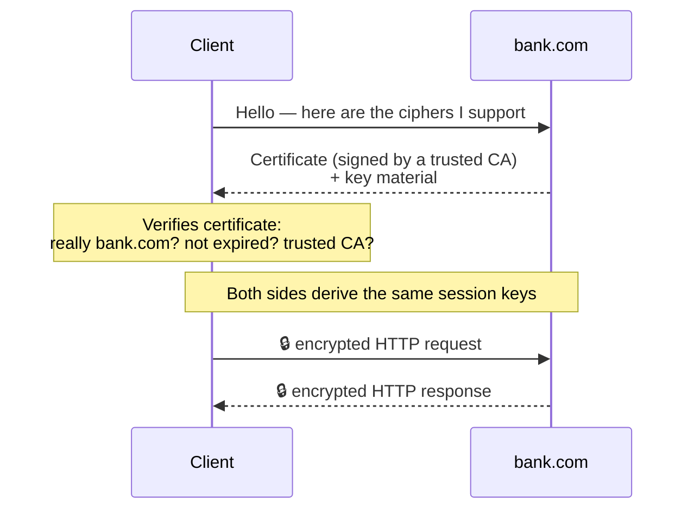

## 11. How HTTPS works

**HTTPS** = HTTP wrapped in **TLS** encryption. It gives you three guarantees:

- **Confidentiality** — eavesdroppers see scrambled bytes, not your password.
- **Integrity** — nobody can tamper with the data in transit undetected.
- **Authentication** — a certificate proves you're really talking to `bank.com`, not an impostor.

Simplified handshake: client and server agree on encryption keys using the server's certificate (issued by a trusted authority), then all further HTTP traffic is encrypted with those keys. Modern handshakes do this in one round-trip.

Plain HTTP is a postcard — every postal worker can read it. HTTPS is a locked box where you and the recipient are the only ones with keys, the lock shows if anyone tampered with it, and there's a notarized seal (the certificate) proving the box really came from your bank and not a forger.

The encryption under HTTPS started at Netscape in 1995 as <b>SSL</b>, built to make shopping on the early web safe. SSL version 1.0 was never released — it was so insecure it never left the building — so the first public version was SSL 2.0. Its modern descendant was renamed <b>TLS</b>, which is why the padlock you see today still gets casually called "SSL".

