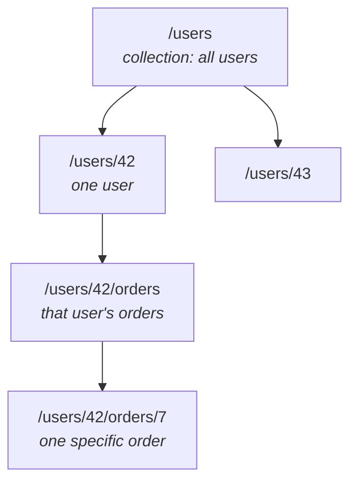

## 3. URIs — naming your resources

A **URI** (the resource's address) should be a **noun**, usually **plural**, and reflect a hierarchy:

```
/users                 → the collection of all users
/users/42              → one specific user
/users/42/orders       → all orders belonging to user 42
/users/42/orders/7     → order 7 of user 42
```

Rules of thumb:

- **Nouns, not verbs.** `/users`, not `/getUsers`.
- **Plural collections.** `/orders/7`, not `/order/7`.
- **Hierarchy for relationships.** `/users/42/orders`.
- **Filtering/sorting/paging go in the query string**, not the path: `/products?category=books&sort=price&page=2`.
- **No file extensions or implementation leaks.** Not `/getUsers.php`.

The hierarchy is a tree — each level narrows the scope:



<div class="analogy">
URIs are postal addresses for your data. "12 Oak Street, Apt 4" has a clear structure — city, street, building, unit — and you immediately understand the hierarchy. <code>/users/42/orders/7</code> reads the same way: order 7, inside user 42's orders. A good URI is one you can read aloud and understand without documentation.
</div>

<div class="quiz">
<div class="quiz-q">You need "all of user 42's orders that are delivered, sorted by date". Which URI fits the conventions in this section?</div>
<button class="quiz-opt">/users/42/orders/delivered/sortedByDate</button>
<button class="quiz-opt" data-correct>/users/42/orders?status=delivered&amp;sort=date</button>
<button class="quiz-opt">/users/42/getDeliveredOrders?sort=date</button>
<div class="quiz-why">The path identifies <b>which resource</b> (user 42's orders); filtering and sorting are ways of <b>viewing</b> that resource, so they belong in the query string. Putting <code>delivered</code> in the path invents a fake sub-resource for every possible filter, and <code>getDeliveredOrders</code> sneaks a verb back into the URI.</div>
</div>
