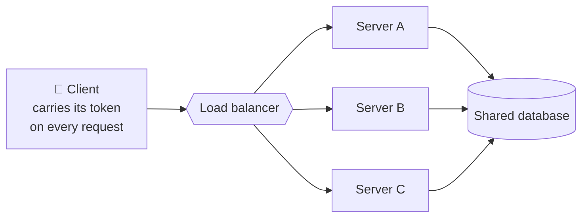

## 5. Statelessness

A REST API is **stateless**: every request must contain *everything* the server needs to handle it. The server keeps **no client session** in memory between requests. If you need to be authenticated, you send your token (Chapter ①, §5/§9) *on every request*.

Why this matters enormously:

- **Scalability** — any server can handle any request, so you can run 100 identical servers behind a load balancer. No request is "stuck" to one machine.
- **Reliability** — if a server dies, no session state is lost; another picks up seamlessly.
- **Simplicity** — no server-side session bookkeeping to corrupt or expire.

> **Stateless ≠ no state.** There's still a database. The point is that *session* state lives with the client (in the token it sends), not pinned inside one server's memory.

Because every request is self-contained, the load balancer can send it to <em>any</em> server — that's what makes horizontal scaling work.

A stateless server is a fast-food counter where <i>any</i> cashier can serve <i>any</i> customer, because the customer's whole order is on the tray ticket they carry (the token). Contrast a stateful setup: a small clinic where only "your" doctor, who remembers your history, can see you — if she's busy or out sick, you're stuck. Statelessness is what lets a system add ten more cashiers at lunch rush without anyone losing their place.

After login, your API stores the user's session in Server A's memory and returns a session ID. Requests with that ID only work if they land on Server A. Is this RESTful?

<button class="quiz-opt">Yes — the client still sends the session ID on every request, so each request is self-contained</button>
<button class="quiz-opt">Yes, as long as the load balancer uses sticky sessions to keep the user on Server A</button>
<button class="quiz-opt" data-correct>No — the request only makes sense with Server A's memory attached, so it isn't self-contained; the auth state should travel in a token the client carries</button>

"Self-contained" means the server can handle the request using only what's <b>in</b> it — a session ID is just a pointer to state hiding in one machine's memory. Sticky sessions paper over the symptom but bring back the exact problems statelessness solves: you can't route freely, and if Server A dies, every session on it is lost.

