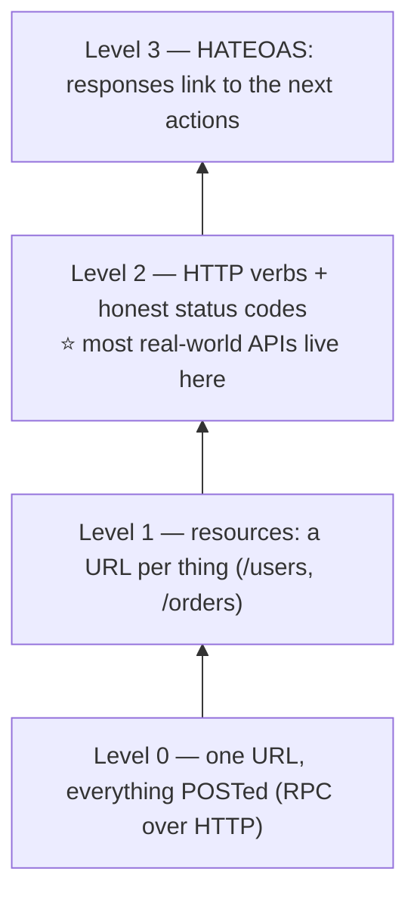

## 7. The Richardson Maturity Model (how "RESTful" are you?)

A handy ladder for judging an API's RESTfulness:

- **Level 0** — one URL, one method (usually `POST`), everything tunneled through the body. "RPC over HTTP."
- **Level 1 — Resources.** Multiple URLs for different things (`/users`, `/orders`), but still one method.
- **Level 2 — HTTP verbs.** Proper use of `GET`/`POST`/`PUT`/`DELETE` and status codes. **Most real-world "REST" APIs live here, and that's perfectly fine.**
- **Level 3 — HATEOAS.** Responses include links to related actions, so the client discovers what it can do next from the response itself, like following hyperlinks.

HATEOAS (Level 3) is browsing a website. You don't memorize every URL — each page <i>links</i> to the next ("Next", "Edit", "Delete"), so you navigate by following links the server hands you. A Level-3 API returns those "links" in its JSON, so the client follows them instead of hard-coding URLs. Powerful, but most teams stop at Level 2 because the tooling and payoff for full HATEOAS rarely justify the cost.

The model is named after Leonard Richardson, who presented it in a 2008 QCon talk; it spread mainly through Martin Fowler's 2010 write-up of it. And HATEOAS holds an awkward record: it's widely considered the <i>least-implemented</i> REST constraint — by Fielding's own definition, the Level-2 APIs most of us ship every day aren't technically REST at all.

