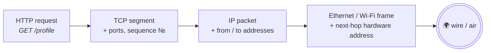

## 1. The layers under your request

In [Chapter ①](#01-http) §1 we said *"the network just moves bytes."* True — but it's not one machine moving them. It's a relay team, and each runner only knows their own leg of the race.

Follow one real request — `GET /profile` to `api.example.com` — down through the stack:

- **Application layer (HTTP)** — your code formats the text message: `GET /profile HTTP/1.1`. It says *what you want*. It has no idea how bytes travel.
- **Transport layer (TCP)** — takes those bytes, slices them into chunks, numbers each chunk, and promises to deliver them *all, in order* to one specific program on the other machine (a **port**). It has no idea what HTTP is.
- **Internet layer (IP)** — wraps each chunk in a packet stamped with source and destination **IP address**, and gets it across the world one router hop at a time. It has no idea what a connection is.
- **Link layer (Ethernet / Wi-Fi)** — physically moves a packet across *one* hop: your laptop to the router, the router to the next cable. It has no idea where the packet is ultimately going.

Each layer wraps the one above it, like envelopes inside envelopes:

Sending = wrapping, top to bottom. Receiving = unwrapping, bottom to top. Each layer reads only its own envelope.

It's international shipping. You write a letter (<b>HTTP</b>) and hand it to a courier service that splits big shipments into numbered boxes and guarantees complete delivery to one specific office suite (<b>TCP</b> — the suite number is the port). The courier slaps a street address on each box and hands it to the global freight network (<b>IP</b>), which moves boxes city-to-city. Each individual truck driver (<b>link layer</b>) only knows their one stretch of road. The letter-writer never thinks about trucks; the truck driver never reads the letter. <b>That ignorance is the design</b> — it's why you could write a web app without ever learning this chapter. (But you're better off knowing.)

### "Wait, I heard there are seven layers"

You'll hear people say *"layer 4 load balancer"* or *"layer 7 firewall."* Those numbers come from the **OSI model**, a 7-layer textbook framework from the 1980s. The real internet runs on the leaner 4-layer TCP/IP stack you just saw — but OSI's *numbering* stuck as vocabulary. Decode it like this: **layer 7 ≈ application (HTTP)**, **layer 4 ≈ transport (TCP)**, **layer 3 ≈ IP**. Nobody routes packets by the OSI model; everybody names things by it.

A "layer 4 load balancer" distributes traffic without ever reading URLs or headers. What information <i>can</i> it use to make decisions?

<button class="quiz-opt">The request path and the <code>Host</code> header</button>
<button class="quiz-opt" data-correct>IP addresses and ports — it never opens the HTTP envelope</button>
<button class="quiz-opt">Cookies, so it can keep a user on the same server</button>

Layer 4 is the transport layer: it sees TCP's envelope (addresses + ports) but treats everything inside as opaque bytes. URLs, headers and cookies live one envelope deeper — in the application layer — which is exactly what a <b>layer 7</b> load balancer opens up to route by path or cookie. That's the whole difference between the two products.

