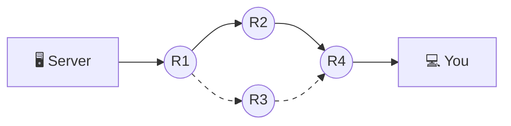

## 2. IP & packets — the "one request" illusion

That 2 MB JSON response your API sent yesterday? It never existed on the network. Not as one thing. The internet has never carried a "request" or a "response" in its life — it carries **packets**, and nothing else.

A packet is a small, self-contained parcel of bytes — on typical networks at most **1,500 bytes** including its headers (a limit called the MTU), which leaves roughly 1,460 bytes of *your data* per packet. Every packet carries:

- a **source IP address** — who sent it
- a **destination IP address** — where it's going
- a slice of your data

Your 2 MB response became roughly **1,400 separate packets**, each one finding its own way across the world.

### Routing: no map, just next steps

No router knows the full path to the destination. Each router only answers one question per packet: *"given this destination address, which neighbor do I hand it to next?"* — then forgets the packet forever. Hop by hop, twenty-some handoffs later, the packet arrives. Two packets from the *same response* can even take **different routes** if a link gets congested or fails mid-transfer.

Packet 17 goes via R2; packet 18 might go via R3. Nobody plans this — each router decides locally, per packet.

### Best-effort delivery — and that's all

Here's the uncomfortable truth: IP promises to *try*. That's the entire contract — it's literally called **best-effort delivery**. In transit, packets can be:

- **lost** — a router's queue overflows and it silently drops your packet. No error, no apology.
- **reordered** — packet 18 took a faster route and arrives before packet 17.
- **duplicated** — rare, but a packet can arrive twice.
- **corrupted** — bits flip; the damaged packet gets discarded (which looks like loss).

And nobody tells the sender. There is no "your packet didn't make it" notification anywhere in IP.

Imagine mailing a novel as 1,400 numbered postcards, dropped in the mailbox one batch at a time. The postal service is fast and usually reliable — but it may lose postcard 212, deliver 305 before 304, and occasionally deliver 87 twice. It will <i>never tell you</i> any of this happened. If the recipient wants the complete novel, in order, <b>someone above the postal service</b> has to number the cards, notice gaps, and ask for re-sends. That someone is TCP — coming in §5 and §6.

About addresses: **IPv4** addresses are the familiar `142.250.190.78` — four numbers, about 4.3 billion combinations, and we've essentially run out. **IPv6** (`2606:2800:21f:cb07::…`) is the roomier replacement with ~3.4 × 10³⁸ addresses, rolling out gradually for two decades. You'll see both in this chapter's `curl` output.

Packet switching was partly a Cold War design goal: ARPANET's research lineage wanted a network with <b>no center to destroy</b>. Because every router decides each packet's next hop independently, packets simply flow around dead routers and cut cables. That 1960s-era resilience is why a backhoe cutting a fiber line today reroutes your cat videos in milliseconds instead of taking down the internet.

