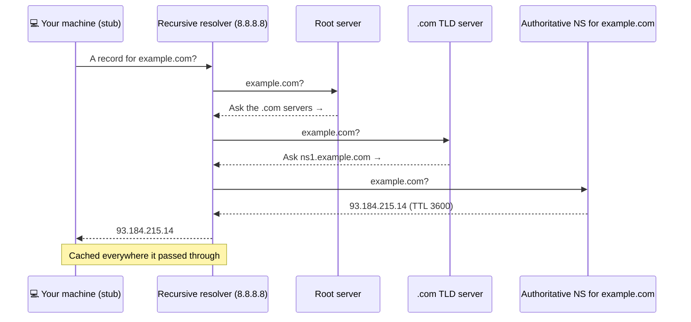

## 3. DNS resolution — the full journey

You type `example.com` and hit Enter. Before a single byte of HTTP can move, your machine has a problem: packets are addressed to **IP addresses**, and `example.com` isn't one. [Chapter ①](#01-http) §1 called DNS "the phone book" and moved on. Now let's watch the lookup actually happen — because it's not one question, it's a chain of them.

### The chain of askers

1. **Caches first.** Your browser checks its own DNS cache; then the OS checks its cache. A hit here costs ~0 ms, and *most* lookups end here.
2. **The stub resolver** — the tiny DNS client built into your OS — gives up on solving it itself and asks a **recursive resolver** (typically your ISP's, or a public one like `1.1.1.1` or `8.8.8.8`): *"Get me the address for example.com. Do whatever it takes."*
3. The recursive resolver (if *its* cache is also cold) walks the hierarchy:
   - asks a **root server**: *"example.com?"* → *"No idea, but here's who runs `.com`."*
   - asks the **`.com` TLD server**: → *"No idea, but here's the authoritative nameserver for `example.com`."*
   - asks the **authoritative nameserver** — the one true source, run by whoever controls the domain: → *"`93.184.215.14`. Trust this for 3600 seconds."*
4. The answer flows back, getting **cached at every step** along the way.

(The IP shown was example.com's real address at the time of writing — run the lookup yourself in §9 and you may get a different one. Addresses change; the journey doesn't.)

You ask a research librarian (the <b>recursive resolver</b>) for an obscure book. She doesn't know it — but she knows the national library index (<b>root</b>), which points her to the right specialist library (<b>TLD</b>), which points her to the one shelf that holds the book (<b>authoritative server</b>). She photocopies the answer and keeps it at her desk (<b>cache</b>), with a sticky note saying how long the copy stays trustworthy (<b>TTL</b>). Ask her again tomorrow and she answers instantly — no phone calls.

### Record types you'll actually meet

| Record | Maps a name to… | Example |
|---|---|---|
| **A** | an IPv4 address | `example.com → 93.184.215.14` |
| **AAAA** | an IPv6 address | `example.com → 2606:2800:…` |
| **CNAME** | *another name* (an alias) | `www.example.com → example.com` |
| **NS** | the authoritative nameservers for the domain | `example.com → ns1.example.com` |
| **MX** | the mail server that accepts email for the domain | `example.com → mail.example.com` |

### The "propagation" myth

Every answer carries a **TTL** (time to live) — how many seconds caches may keep it. This explains web-dev folklore: you change your DNS, and people tell you it takes *"24–48 hours to propagate."* Here's the secret: **DNS changes don't propagate at all.** Nothing pushes your new record anywhere. Resolvers all over the world are simply holding cached copies of the *old* answer, each expiring on its own schedule. Once a cache's TTL runs out, its *next* lookup fetches the new record. That's why pros lower the TTL to 60 seconds *a day before* a migration — so the world's sticky notes expire fast when it counts.

You point <code>example.com</code> at a new server. Your friend abroad sees the new site instantly; you keep landing on the old one for an hour. Why?

<button class="quiz-opt">The change is propagating outward from the registrar, and your country hasn't received it yet</button>
<button class="quiz-opt" data-correct>Your resolver (or OS/browser) still holds a cached answer whose TTL hasn't expired; your friend's caches were cold, so they fetched the fresh record</button>
<button class="quiz-opt">The old server is intercepting your requests until its lease expires</button>

There is no outward push. Whoever asks <i>after</i> their cached copy expires gets the new answer from the authoritative server; whoever holds an unexpired copy keeps using it. Your friend simply hadn't looked the name up recently. (Impatient fix: flush your OS DNS cache, or query the authoritative server directly with <code>dig</code> — see §9.)

The entire internet's root zone is served under just <b>13 root server names</b> (a.root-servers.net through m). It's not 13 machines, though — behind those names, <i>anycast</i> routing spreads the load across <b>1,900+ physical servers worldwide</b>, and your packets automatically reach a nearby one. Before DNS existed (1983), every computer on the internet downloaded one shared <code>HOSTS.TXT</code> file from SRI's Network Information Center with everyone's addresses in it.

