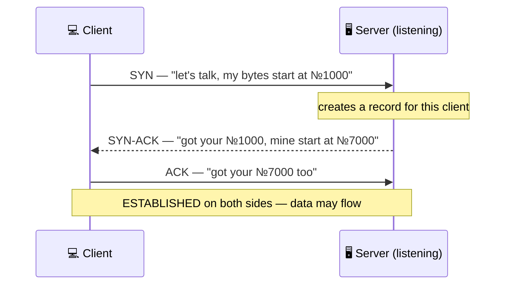

## 5. The TCP handshake — what a "connection" really is

Here's a question that breaks brains in the best way: when your laptop holds a TCP connection to a server in Frankfurt, *where is the connection?* Trace the path — your Wi-Fi, the router, the fiber under the Atlantic. You'll find packets in flight, but no "connection" anywhere. Nothing is reserved for you. No circuit, no wire, no lane.

A TCP connection is a **shared illusion**: a matching pair of records in two operating-system kernels — yours and the server's — each remembering *"I'm in a conversation with that address:port, I've sent bytes up to №X, I've received up to №Y."* The wires between know nothing. That's why establishing a connection means nothing more (and nothing less) than **getting both sides to agree to start counting**.

### The three-way handshake

That agreement takes exactly three messages:

- **SYN** (synchronize): the client proposes a connection and announces its starting **sequence number** — the basis for the byte-numbering that powers §6. (Real starting numbers are randomized; 1000/7000 keep the picture readable.)
- **SYN-ACK**: the server acknowledges the client's number *and* announces its own.
- **ACK**: the client acknowledges back. Both sides now hold mirrored state: the connection "exists."

Count the cost: one full **round trip** before the first byte of HTTP can even leave. Remember that — it's the heart of §7.

It's the start of every phone call ever: <i>"Can you hear me?"</i> (SYN) — <i>"Yes! Can you hear me?"</i> (SYN-ACK) — <i>"Yes."</i> (ACK). Only now does the actual conversation start. Skipping any step leaves one side unsure the line works both ways: three messages is the <b>minimum</b> for two parties to each know the other can both hear and be heard.

### Hanging up: FIN and TIME_WAIT

Teardown is symmetric politeness: each side sends a **FIN** ("I'm done sending") and ACKs the other's — so a connection closes in both directions independently, usually four small messages in total.

One famous quirk: the side that closes *first* keeps the dead connection's record around for a minute or so in a state called **TIME_WAIT** — long enough for any stragglers of this conversation still crossing the network to arrive and die quietly, instead of being mistaken for part of a *new* connection that reuses the same ports. If you ever run a load test and find thousands of `TIME_WAIT` entries in `netstat`, that's not a leak — that's TCP being careful.

The handshake has a dark side: when a server receives a SYN, it allocates memory for the half-open connection <i>before</i> knowing if the client is real. A <b>SYN flood</b> attack exploits this — blast millions of SYNs from fake addresses, never complete step 3, and the server drowns in bookkeeping for ghosts. It's one of the oldest denial-of-service tricks on the internet, and defenses against it (like SYN cookies, invented in 1996) are baked into every modern OS kernel.

